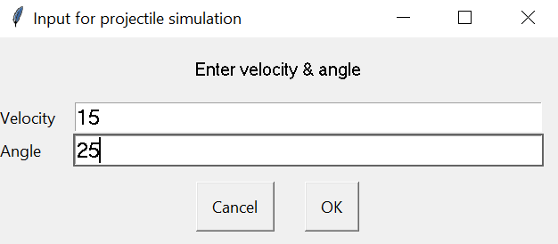
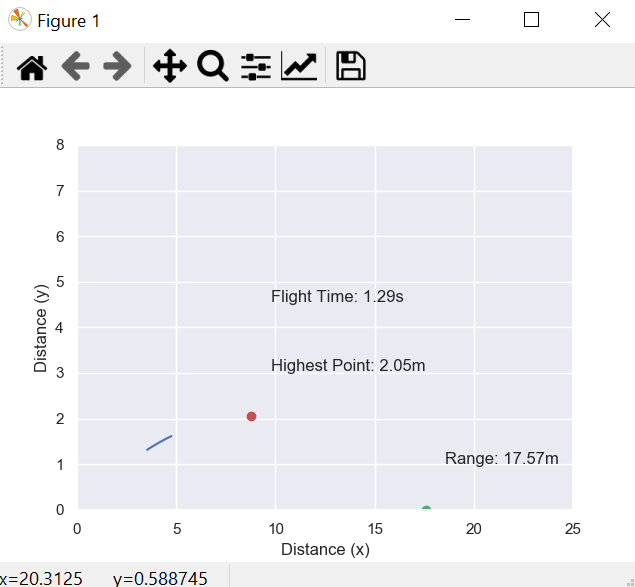

# Projectile-Motion-Visualization-with-Matplotlib

## How to use


Enter the initial velocity and launch angle.



The curved line will go through the projectile's trajectory.
The red dot represents the highest point of the trajectory & the green one shows the horizontal distance or the range of the projectile.
It also shows the output value of both including the value of total flight time.

### Viewing in Jupytar Notebook
```python
from IPython.display import HTML
animation = camera.animate()
HTML(animation.to_html5_video())
```
