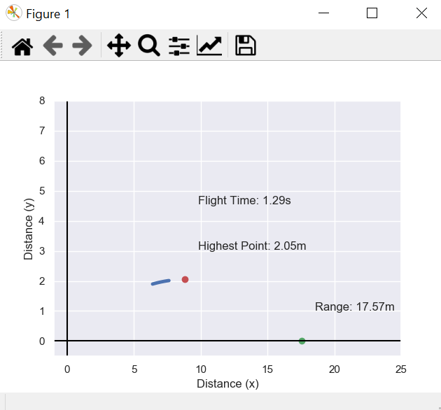

# Projectile-Motion-Visualization-with-Matplotlib

## How to use


Enter the initial velocity and launch angle & click OK to start the matplotlib animation.



The curved line will go through the projectile's trajectory.
The red dot represents the highest point of the trajectory & the green one shows the horizontal distance or the range of the projectile.
It also shows the output value of both including the value of total flight time.

### Viewing in Jupytar Notebook
```python
from IPython.display import HTML
animation = camera.animate()
HTML(animation.to_html5_video())
```
or 
```python
from IPython.display import HTML
animation = camera.animate()
HTML(animation.to_jshtml())
```
## Code & Formulae
### EasyGui Inputs
We will be taking two input by using easygui.multenterbox. 
```python
fieldNames = ["Velocity","Angle"]
fieldValues = []
fieldValues = easygui.multenterbox(msg,title, fieldNames)
```
If we don't get exact two values for the formulae, easygui will ask again to enter the values.
```python
while 1:
    if fieldValues == None: break
    errmsg = ""
    for i in range(len(fieldNames)):
        if fieldValues[i].strip() == "":
            errmsg = errmsg + ('"%s" is a required field.\n\n' % fieldNames[i])
    if errmsg == "": break # no problems found
    fieldValues = easygui.multenterbox(errmsg, title, fieldNames, fieldValues)
print ("Reply was:", fieldValues)
```
### Formulae


```python
g = 9.81                                                       
v = float(fieldValues[0])                                      
theta = float(fieldValues[1])  * np.pi / 180.0                
t = 2 * v * np.sin(theta) / g
r_for_h= v*np.cos(theta)*(t/2)
h=((v**2) *(np.sin(theta)**2))/(2*g)
r= (v**2) * np.sin(2*theta) / g
```
Here, 'h' refers to the highest point, 'v' is the initial horizontal velocity, 'g' is the gravitational acceleration, 'theta' is the launching angle, r is the horizontal range.
'v' and 'theta' are going to get their values from fieldValues[0] and fieldValues[1] respectively.

We, used the formulae for the other variables and derived r_for_h which is the horizontal distance when the vertical distance is the highest.
